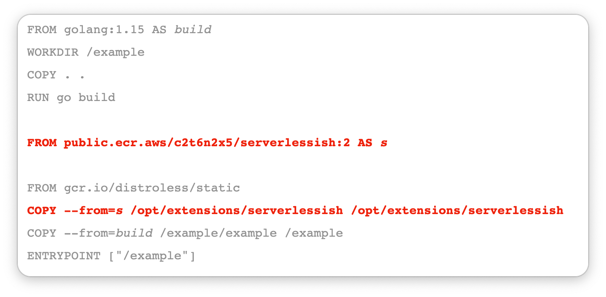

# serverlessish

**tl;dr** Run the _exact same image_ for websites in Lambda as you do in ECS, Kubernetes, etc. Just add this to your
Dockerfile, listen on port 8080 and have a health check returning 200 at `/ping`. **This image will now work in Lambda 
and everywhere else and adds less than 2 MB**.



Those lines for copy-paste friendliness:

```Dockerfile
FROM public.ecr.aws/c2t6n2x5/serverlessish:1 AS lh
# FROM ...
COPY --from=lh /opt/extensions/serverlessish /opt/extensions/serverlessish

# optionally add these lines
ENV PORT=9090                        # maybe you want a different port
ENV LH_HEALTHCHECK_PATH=/healthcheck # or a different healthcheck path
```

## TODO

More documentation.

**Story time**: Christmas came early in 2020 with the release of [container image support for AWS Lambda][blog]. It 
meant that  serverless applications could now be packaged in standard Docker images rather than Lambda-specific ZIP 
files.  Additionally, the 50 MB limit for ZIP files doesn't apply to containers: they can be as enormous as 10 GB.

[blog]: https://aws.amazon.com/blogs/aws/new-for-aws-lambda-container-image-support/
